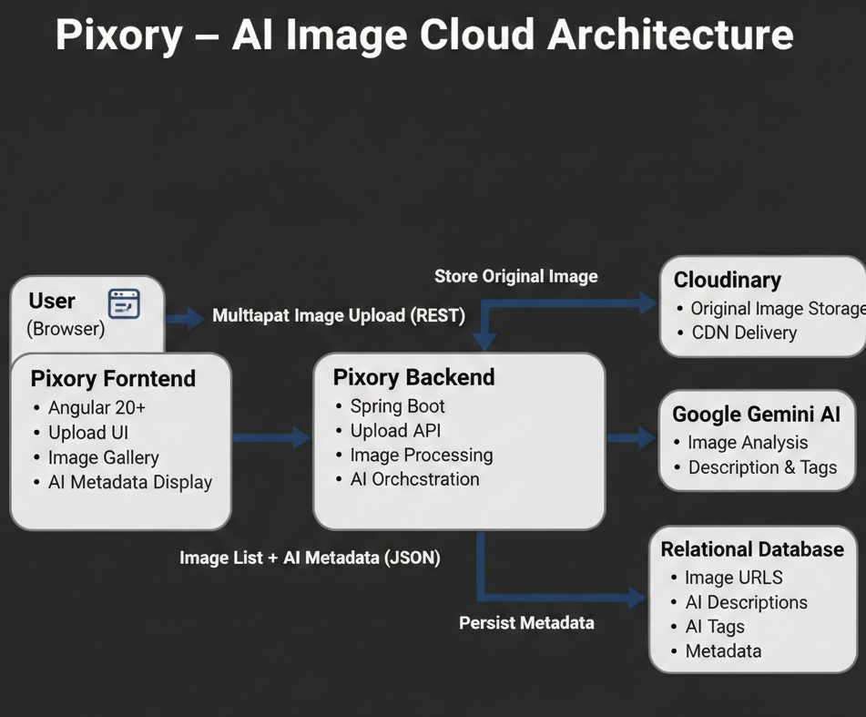

# Pixory – AI Private Photo Cloud

<p align="center">
  
</p>


Pixory is a full-stack project focused on building a clean, scalable image platform that securely stores photos, enriches them with AI-generated metadata, and presents them through a modern web interface.

This repository acts as the **project hub**, documenting the architecture, journey, and design decisions behind Pixory.

---

## Project Scope (v1)

Pixory v1 is intentionally narrow:

> Upload → Store → Analyze → Display

No social features. No fake scale. No buzzwords.

---

## Architecture Overview

Pixory is split into two independent repositories to reflect real-world application boundaries.

```text
Pixory (Project Hub)
│
├── 📂 Pixory Backend ──────────► [Spring Boot + AI Pipeline]
│   └── Repo: pixory-image-cloud-backend
│
└── 📂 Pixory Frontend ─────────► [Angular + UX]
    └── Repo: pixory-image-cloud-frontend  
 ```    


This separation enforces:
- Clear responsibility boundaries
- Independent development and scaling
- Realistic production architecture

---

## Repositories

### 🔧 Backend – Image Cloud & AI Pipeline
**Repository:**  
👉 https://github.com/RohitSalv/pixory-image-cloud-backend

**Responsibilities:**
- Secure image uploads
- Cloud storage using Cloudinary
- AI-based image analysis (descriptions & tags)
- Metadata persistence using JPA/Hibernate
- REST API for frontend consumption

**Key Focus:**  
Scalability, reliability, and AI cost optimization.

---

### 🖼️ Frontend – User Experience & Gallery
**Repository:**  
👉 https://github.com/RohitSalv/pixory-image-cloud-frontend

**Responsibilities:**
- Image upload UI with preview
- Responsive image gallery
- Display of AI-generated metadata
- Landing page and application flow

**Key Focus:**  
Calm UX, minimal noise, and clear user flow.

---

## Technology Stack




### Backend
- Spring Boot 3.x
- Java 17
- Google Gemini 2.5 Flash (AI)
- Cloudinary
- MySQL / PostgreSQL
- Thumbnailator

### Frontend
- Angular 20+
- Tailwind CSS v4
- RxJS
- Angular Animations
- Lucide Icons

---

## Key Engineering Decisions

### Why Two Repositories?
Splitting frontend and backend reflects real-world system design, simplifies deployment, and prevents tight coupling between UI and core logic.

### Why AI Image Analysis?
Manual tagging does not scale. AI-generated descriptions and tags enable searchability and metadata enrichment without user effort.

### Why Narrow v1 Scope?
Early versions fail when everything feels important. Pixory v1 was constrained to a single, explainable flow to ensure completion and clarity.

---

## Project Journey

Pixory was not built linearly.

The idea started broad (“AI-powered image cloud”), became unmanageable, and was later reduced to a strict v1 definition. Multiple design, storage, and AI-related mistakes were made and corrected.

The full journey, including failures and course corrections, is documented separately:

📄 **PIXORY_JOURNEY.md**  
Look In JOUNEY_MDs Folder

Theme: *“The Idea Was Clear, the Path Was Not”*

---

## Current Status

- Core backend pipeline: ✅ Complete
- AI analysis & optimization: ✅ Stable
- Frontend gallery & upload flow: ✅ Complete
- Advanced search & UX enhancements: 🚧 Planned

This project is considered **v1 complete**, not finished.

---

## Why This Project Exists

Pixory exists to demonstrate:
- Full-stack system thinking
- AI integration beyond demos
- Architectural discipline
- The ability to stop and ship v1

---

## License

This project is intended for learning, experimentation, and portfolio demonstration.
